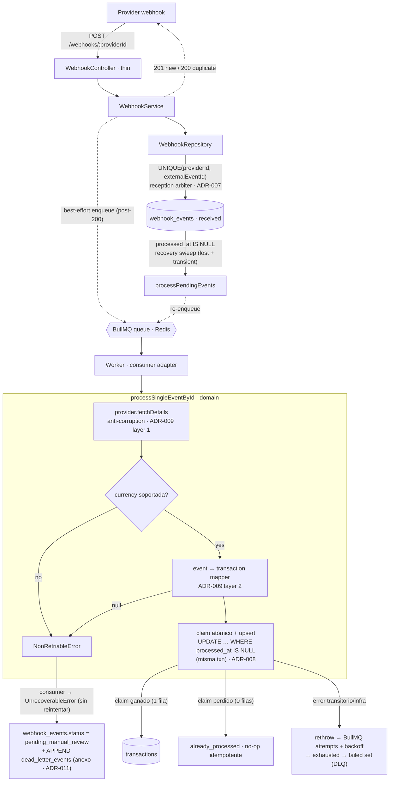

# Payment Reconciliation Hub

[](https://github.com/USERNAME/payment-reconciliation-hub/actions/workflows/ci.yml)

> Open-source payment reconciliation system. Multi-provider abstraction, idempotent webhooks, and discrepancy reporting.

## What is this?

Fintech platforms integrate multiple payment providers (gateways, banks, processors), each with its own API, webhook format, transaction model, and settlement window. Reconciling internal records against external reports is critical and error-prone.

**Payment Reconciliation Hub** abstracts payment providers behind a unified interface, receives webhooks idempotently with smart retries, reconciles internal vs external transactions, and reports discrepancies.

## Why does this project exist?

This is a learning project for a senior engineer reactivating hands-on coding skills, built openly to demonstrate:

- Idempotent webhook processing
- Multi-provider abstraction patterns
- Async processing with retry strategies
- Reconciliation algorithms
- Production-grade testing and observability

See [docs/adrs/](./docs/adrs/) for architectural decisions and reasoning.

## Stack

| Layer | Technology |
|-------|-----------|
| Runtime | Node.js 20+ |
| Language | TypeScript (strict) |
| Framework | NestJS — [why?](./docs/adrs/002-nestjs-framework.md) |
| Database | PostgreSQL — [why?](./docs/adrs/003-postgres-over-mongo.md) |
| Queue | BullMQ (Redis) |
| Tests | Jest + Supertest |
| Container | Docker Compose |
| CI/CD | GitHub Actions |

## Quick start

### Prerequisites
- Node.js 20+
- Docker & Docker Compose
- npm or pnpm

### Setup

```bash
# Clone
git clone https://github.com/USERNAME/payment-reconciliation-hub.git
cd payment-reconciliation-hub

# Install dependencies
npm install

# Start infrastructure (Postgres + Redis)
docker-compose up -d

# Run migrations
npm run migration:run

# Start the application
npm run start:dev
```

Application runs at `http://localhost:3000`.
API docs at `http://localhost:3000/api/docs`.

### Testing

```bash
npm run test          # unit tests
npm run test:e2e      # end-to-end
npm run test:cov      # with coverage
```

## Architecture

```
┌─────────────────────────────────────────────────┐
│                  API Gateway                     │
│           (NestJS REST + Swagger)               │
└──────────┬──────────────────────┬────────────────┘
           │                      │
    ┌──────▼──────┐        ┌──────▼──────┐
    │ Transactions│        │  Providers  │
    │   Module    │        │   Module    │
    └──────┬──────┘        └──────┬──────┘
           │                      │
    ┌──────▼──────────────────────▼──────┐
    │      Webhooks Module                │
    │  (receivers, idempotency, retry)    │
    └──────────────┬──────────────────────┘
                   │
            ┌──────▼──────┐
            │   BullMQ    │
            │   Queue     │
            └──────┬──────┘
                   │
    ┌──────────────▼──────────────────────┐
    │     Reconciliation Engine            │
    │  (matching, discrepancies, reports)  │
    └──────────────┬──────────────────────┘
                   │
            ┌──────▼──────┐
            │  PostgreSQL │
            └─────────────┘
```

### Webhook → Transaction flow (async + idempotent — what's actually built)

> Reception and processing are **decoupled**: the endpoint persists + acks fast, and a
> BullMQ worker processes the event off the critical path. Two idempotency arbiters
> (reception + processing) make the at-least-once delivery safe; failures route by class.



**Por qué dos árbitros:** recepción deduplica el *evento* (UNIQUE); procesamiento garantiza cuántas veces *actúo* sobre él (claim). Un evento único igual puede doble-procesarse bajo at-least-once sin el claim → ese es el rol de ADR-008.

**Un árbitro por clase de fallo (ADR-010):** transitorio/infra → BullMQ reintenta con backoff (durabilidad en Redis, sobrevive a la muerte del worker) → failed set al agotarse; permanente (lista finita: `NonRetriableError`) → el consumer lo traduce a `UnrecoverableError` (no reintenta) → `pending_manual_review`. No hay doble conteo: cada clase va a un solo árbitro. El default es **retriable**, seguro porque el claim hace el reproceso idempotente.

### How the queue is used

- **Producer:** tras persistir el evento como `received` y devolver el 200, el service encola un job (pass-by-id, `jobId` para dedup de in-flight) **best-effort** — el ack al provider no espera al enqueue (200-post-save).
- **Consumer:** el worker BullMQ toma el job y llama `processSingleEventById`. La cola es transporte; la corrección vive en el dominio (claim atómico).
- **Recovery sweep:** `processPendingEvents` barre `processed_at IS NULL` y re-encola — cubre las dos clases que la cola sola no puede: mensajes que nunca se encolaron (enqueue falló) y fallos transitorios. El claim hace segura la carrera cola↔barrido.
- **Retry/DLQ:** `attempts` + backoff exponencial viven en `defaultJobOptions` (propiedad del job, no por-caller). Ver ADR-010.
- **Dead-letter (dos superficies, hoy):**
  - **Dominio no-retriable** (`pending_manual_review`) → **anexo durable `dead_letter_events`** (ADR-011): tabla append-only que **apunta** al evento (FK, sin unique → N filas = audit trail) y agrega solo `reason` / `last_error` / `failed_at`. No copia el estado (`webhook_events.status` es la única fuente de verdad → drift imposible). El double-write (status + anexo) se resuelve por **orden** (append primero), no por transacción.
  - **Retriable agotado** → por ahora cae en el **failed set de BullMQ** (Redis, volátil) — **todavía NO** aterriza en el anexo durable. Gap consciente (ver ADR-011, scope): la captura del agotamiento requiere un hook `@OnWorkerEvent('failed')`. Pendiente.

### Implemented endpoints (what's actually built)

| Endpoint | Purpose |
|----------|---------|
| `POST /webhooks/:providerId` | Idempotent reception (UNIQUE arbiter · ADR-007). `201 new` / `200 duplicate`. |
| `GET /transactions/:id` | Read a transaction. Domain error (`TransactionNotFoundError`) mapped to `404` via a polymorphic exception filter, not a framework exception in the service. |
| `GET /reconciliation-status` | Read-only observability lens: unprocessed events (`received` / `pending_manual_review` with `processed_at IS NULL`), ordered by `received_at` ascending so aging is visible. Does **not** assert orphan-hood yet — no state machine / processing-window modeled. |

> Note: `processPendingEvents` (the processing flow above) is invoked internally, not over HTTP.

## Documentation

- [Architecture Decision Records](./docs/adrs/) — why the system is built this way
- [API Documentation](http://localhost:3000/api/docs) — Swagger (run locally)
- [Contributing](./CONTRIBUTING.md) — coming soon

## Project status

🚧 **Work in progress** — early development, not production-ready.

## License

MIT
